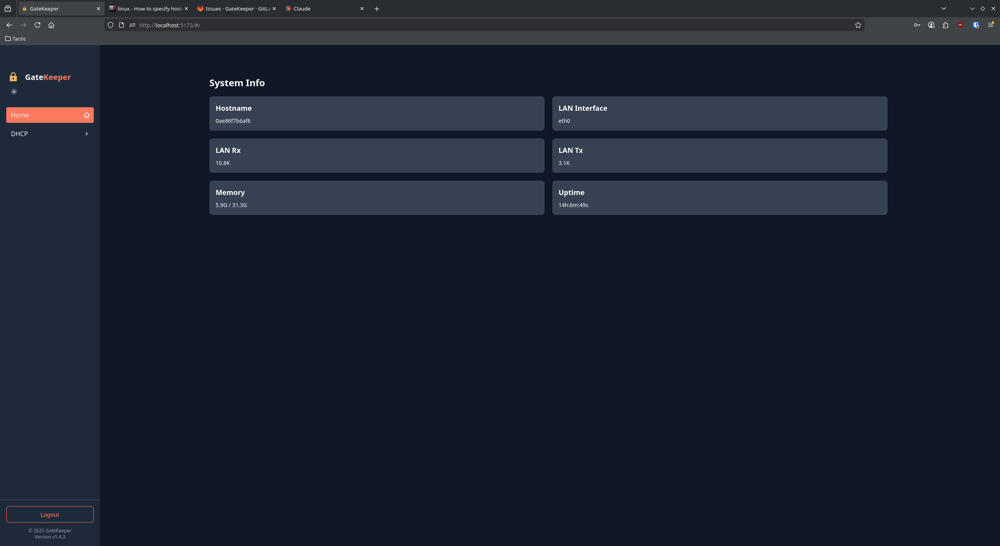
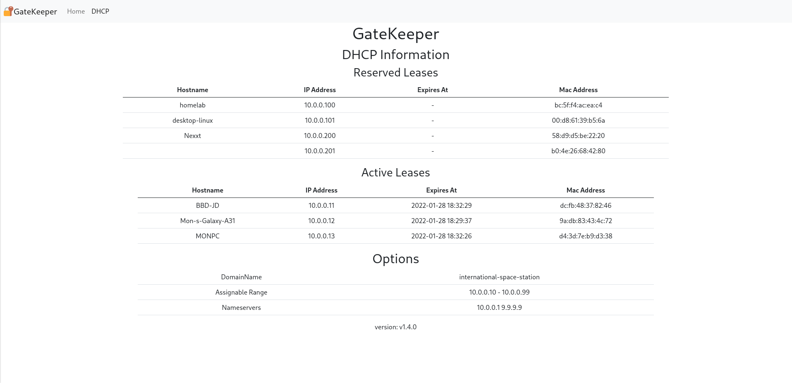

# GateKeeper

GateKeeper is a configurable hobbyist DHCP server written in Go.

It is **not** intended for production use, but it powers my home network just fine!

## Installation

Install gatekeeper from source with `go install gitlab.com/thatjames-go/gatekeeper-go@latest` or download one of the binaries under the [releases](https://gitlab.com/thatjames-go/gatekeeper-go/-/releases) page.

## Building

### Native Binary

```bash
make build
```

### Docker Image

```bash
make docker
```

## Running

The binary will look for a `config.yml` file in the PWD, or it can be passed with the `-c <file>` flag.

### Webserver

If the webserver is enabled, but no `htpasswd` file has been specified, then the default login credentials are admin/admin.

In order to secure the webserver, you can create an `htpasswd` file and specify where to find it in the `HTPasswdFile` field under the `Web` config.

On Linux, you can create this file using the following commands (requires `openssl`):

```bash
echo username:$(echo password | openssl passwd -stdin -apr1) > .htpasswd
```

Remember to replace `username` and `password` with your own values

#### Screenshots





## Configuration

Example config:

```yaml
DHCP:
  Interface: eth0
  DomainName: gatekeeper
  StartAddr: 10.0.0.2
  EndAddr: 10.0.0.99
  LeaseTTL: 300
  SubnetMask: 255.255.255.0
  Router: 10.0.0.1
  NameServers:
    - 8.8.8.8
    - 1.1.1.1
  ReservedAddresses:
    aa:aa:aa:aa:aa:aa: 10.0.0.100

Web:
  Address: :8080
  HTPasswdFile: .htpasswd
```

### DHCP

The DHCP configuration section.

#### Interface

The interface name gatekeeper will bind to

#### DomainName

The domain name option supplied in DHCP responses

#### StartAddr

The first assignable DHCP address gatekeeper will hand out

#### EndAddr

The last assignable DHCP address gatekeeper will hand out. This makes the effective pool equal to (StartAddr - EndAddr) + 1 (inclusive). Our example has 98 possible addresses.

#### Lease TTL

Time To Live for given leases

#### SubnetMask

The subnet mask option returned in the DHCP response

#### Router

The router option returned in the DHCP response

#### NameServers:

An array of values for the NameServer option(s) returned in the DHCP response

#### ReservedAddresses

A mapping of mac_address:desired_static_ip to provide static IP addresses to clients. Make sure this is outside of the assignable range of start and end addresses

### Web

The webserver configuration section. If this section is not defined, gatekeeper will not run a web server.

#### Address

Listen address the webserver should bind to

#### HTPasswdFile

Relative or Fully Qualified path to the htaccess file

**note:** if no `HTPasswdFile` is provided, then the default username/password is admin/admin
